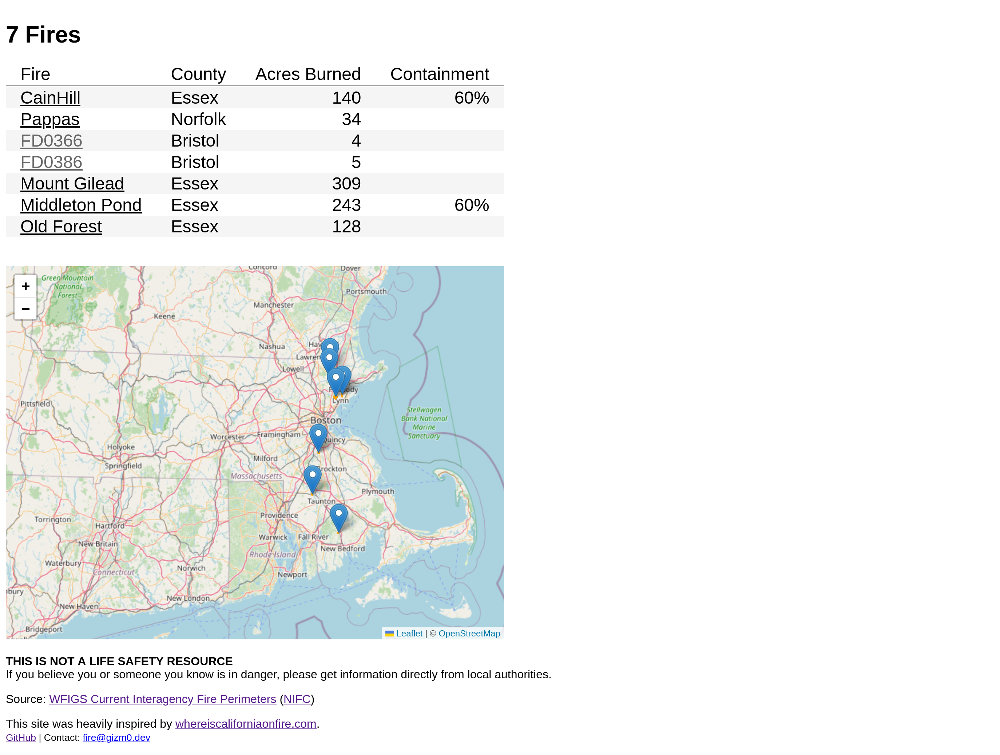

# whereismassachusettsonfire.com

 (basic page, as of 11/11/2024 at midnight)

A simple site to track any active wildfires in Massachusetts, pulling data from NIFS.

Heavily inspired by [whereiscaliforniaonfire.com](whereiscaliforniaonfire.com), I've had this idea for a while and finally decided to make it during the [2024 fall historic drought](https://www.mass.gov/news/major-drought-declared-across-massachusetts) and the elevated fire risk it brought.

---

## Developing

Once you've created a project and installed dependencies with `npm install` (or `pnpm install` or `yarn`), start a development server:

```bash
npm run dev

# or start the server and open the app in a new browser tab
npm run dev -- --open
```

## Building

To create a production version of your app:

```bash
npm run build
```

You can preview the production build with `npm run preview`.
